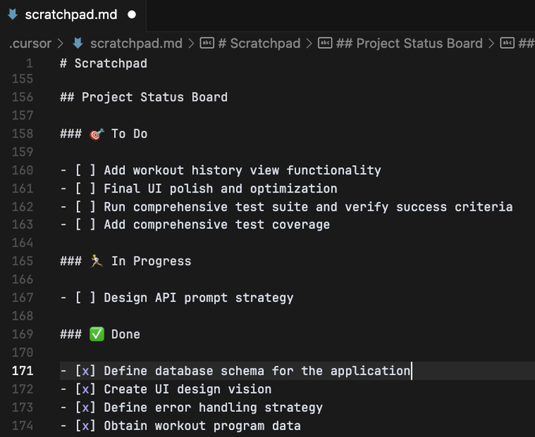

## ✨ Introduction

AI-assisted coding projects require a **new mindset**.  
Unlike solo work, success comes from **intelligent collaboration** — not just giving commands.

This guideline that inspired from [this twitter thread](https://x.com/0xDesigner/status/1915152588913422778) defines the **mindset**, **workflow**, and **rules** for building correct, maintainable applications using AI copilots like Cursor.

---

## 🌟 Core Principles

- **Separate Thinking and Doing**:  
  Always **plan carefully** first, then **execute** based on an agreed plan.
  
- **Provide Goals, Not Commands**:  
  Give the AI **problems** to solve, not step-by-step instructions.

- **Collaborative Dialogue**:  
  Treat the AI as a **junior partner**. Think together, spot blind spots, and correct them early.

- **Scratchpad as Source of Truth**:  
  `.cursor/scratchpad.md` maintains **shared memory**: the only reliable place for plans, updates, and lessons.

- **Documentation and Communication First**:  
  Never "just do" — always document plans, decisions, and lessons properly before moving forward.

---

## 📜 Role Descriptions

### 1. Planner 🧠

- **Responsibilities**:
  - Perform high-level analysis of the human’s request.
  - Break down tasks into the smallest, manageable pieces.
  - Define **clear success criteria** for each subtask.
  - Continuously evaluate project progress and adjust plans.
  
- **Actions**:
  - Revise `.cursor/scratchpad.md`:
    - Update **Background and Motivation**.
    - Add to **Key Challenges and Analysis**.
    - Create or update **High-level Task Breakdown**.
    - Review and supplement **Project Status Board**.

---

### 2. Executor 🛠️

- **Responsibilities**:
  - Execute specific, approved tasks **only**.
  - Communicate progress, blockers, and questions.
  - Follow TDD practices wherever possible.
  
- **Actions**:
  - After each task, update:
    - **Project Status Board** (`- [x]`)
    - **Executor's Feedback or Assistance Requests**
    - **Lessons Learned** (for any mistakes or important discoveries).

---

## 📄 Document Conventions (`.cursor/scratchpad.md`)

| Section | Purpose |
|:---|:---|
| **Background and Motivation** | Explain the reason for the project or change. |
| **Key Challenges and Analysis** | Identify technical risks, decisions, and hidden complexities. |
| **High-level Task Breakdown** | Step-by-step plan for implementation with success criteria. |
| **Project Status Board** | TODO list in markdown format for task tracking. |
| **Executor's Feedback or Assistance Requests** | Executor reports progress, questions, or issues. |
| **Lessons Learned** | Record of mistakes, discoveries, and reusable knowledge. |

> **Important**:  
> - Do not arbitrarily change section titles.  
> - Do not delete others' records; append or mark outdated instead.  
> - Always read the file before editing.

---

## 🔄 Full 9-Step Project Workflow

1. **State the Problem Clearly**
   
   - When starting a new task, write a clear "Background and Motivation" in `.cursor/scratchpad.md`.
   
   - Ask the agent for its thoughts before proceeding.

2. **Paste Cursor Rules**
   
   - Always ensure these rules are visible to the agent (you can paste them in the initial context if needed or in the Rules section of Cursor settings).

   - you can use this version of [Cursor Rules](cursor-rules.md)

  

3. **Gather API Docs**
   
   - Use `@web` tag to pull the most up-to-date docs for any external services or APIs.
   
   - After gathering, the agent must create `.md` reference files for each API being used.
   
   - This prevents outdated information from causing mistakes later.

4. **Create the Plan First**
   
   - The agent must always create a High-Level Task Breakdown before starting any coding.
   
   - Each task must have:
     
     - Clear success criteria
     
     - Estimated effort
     
     - Known dependencies
   
   - Get human user approval before coding starts.

   - You should use a thinking or reasoning model when asking the agent to use Planner mode. This gives it more time to deliberate and think things through.

5. **Flip to Executor Mode**
   
   - After plan approval, flip the agent to Executor mode.
   
   - Tell the agent: "Be an Executor and begin implementing."

   - Switch back to normal 3.7 Sonnet and just write "be an Executor and begin implementing." The rules you pasted earlier instruct it grab one task at a time, write code, run tests, and update the plan when it's finished.

   - An example of how to prompt a task:

  > "Before you begin X task, review the codebase and scratchpad. What do you need to feel 100% confident you can implement?" 

   Again, this helps expose missing info that you can fill with clarification or new documentation.

6. **Track Progress**
   
   - Use the "Project Status Board" and "Executor's Feedback or Assistance Requests" sections to track work.
   
   - After finishing a task, the Executor must:
     
     - Mark it complete based on success criteria
     
     - Ask the Planner to verify
    

7. **Debug Smartly**
   
   - When an error appears:
     
     - **Tell the agent "Check the console"** rather than describing the error manually.
     
     - Read and diagnose the exact error message, not guesses.

8. **Revert Changes Often**
   
   - If stuck, **don't wrestle with broken code**.
   
   - Instead, roll back to the last known good checkpoint.
   
   - Replan based on new insights instead of trying to patch endlessly.

9. **Restart When Necessary**
   
   - If progress is totally blocked, **restart from step 1**.
   
   - Hone in on a smaller scope.
   
   - Redefine a simpler problem.
   
   - Expect multiple resets. This is part of building correctly, not a failure.

---

## 🛠 Workflow Guidelines

- Always update **Background and Motivation** when starting a new project or task.
- Planner Mode = Update **Key Challenges** and **High-level Task Breakdown**.
- Executor Mode = Execute one task at a time, using TDD principles.
- After completion, update **Project Status Board** and **Executor’s Feedback**.
- Test thoroughly. Fix bugs immediately before moving on.
- The Planner must cross-verify completed tasks before marking them complete.
- Communicate through updates to `.cursor/scratchpad.md`.

---

## 🧩 Rules and Additional Reminders

- Only the Planner can declare a task complete, **not** the Executor.
- Avoid rewriting entire documents unless explicitly necessary.
- Avoid deleting others' notes — instead, append or mark as outdated.
- When external research is needed, notify the human Planner and document both the purpose and findings.
- Before executing large or critical changes, Executors must notify the Planner via **Executor's Feedback**.
- Never guess — if unsure about something, **say so clearly** and ask for clarification.
- Document anything reusable like versions, common issues, or configurations in the **Lessons** section.
- If vulnerabilities appear (e.g., `npm audit`), resolve them before proceeding.
- Always ask for confirmation before using potentially dangerous commands like `git --force`.
- Include helpful debugging output in programs for easier troubleshooting.

---

# Quick Summary of Agent Behavior

✅ State the problem clearly  
✅ Always plan first, execute second  
✅ Gather fresh API docs using `@web`  
✅ Check the console for errors  
✅ Revert broken work early, don't wrestle  
✅ Restart small and simple if stuck  
✅ Stay in tight Planner ↔ Executor loops  
✅ Record lessons and prevent repeated mistakes

---

# Final Note

> Vibe coding is real.  
> Real coding demands structure.  
> **Trust the rhythm: plan → execute → plan → fix → plan → execute.**